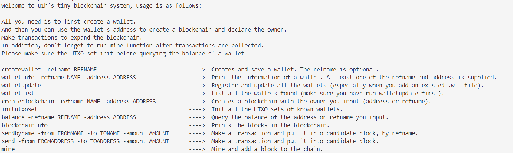

> This project is based on the original project by Leo Cao. You can locate it at [here](https://www.zhihu.com/column/c_1425139266972626944).
> [深入底层：Go语言从零构建区块链](https://www.zhihu.com/column/c_1425139266972626944)
> For my project, the entire source code can be found at my github.
> [github.com/lo4u/GO_BlockChain](https://github.com/lo4u/GO_BlockChain)

# Outline
This local blockchain is a tiny simple blockchain, consisting of four main components and other smaller components.The four are blockchain, wallet, transaction and cli program.

## wallet
Forgive me begining with the part of wallet.
The wallet consists of a ecdsa.privateKey and a public key's byte slice bound from public key. A wallet holds a address which can be converted to and from a public key's hash. Wallets those have not conducted any transaction occupy little storage. Like a acount, every wallet holds a local UTXO set file, which stores the balance information. Note that this struct is only avaliable locally. 
When you specify two wallets' address and call the function to create a transaction, it will sign the transaction's inputs with the initiator's private key. Others can use public key provided by each input to verify the validity of this transaction.

## blockchain
This is the core of this project.
A blockchain can be a struct consisting of a database which store all blocks on this chain and a hash value representing the newest block (current block). The latter acts like the 'head' in git. The blockchain can be iterated through, create or update a UTXO set corresponding a wallet, which will be stored and maintained by the wallet.
A chain usually has a genesis block, which has specified PrevHash and Hash.
For a chain, a transaction pool must be maintained. In my project, it's a local file. Every transaction created on this chain will be stored in this pool. Then A full node can mine. During that process, each transaction's sign will be verified and All transaction will be bound into a candidate block. After PoW process, the block will be added to this chain. Now, these transactions are confirmed.

## transaction
A transaction struct stores as little transaction information as possible. It includes a ID value that is equivalent to its hash, a set of inputs and a series of outputs. In every transaction, a UTXO must be ran out of. If there are any extra parts, the output address should be yours.
When created, every transaction must be signed by ECC cipher. And  the operation should be performed separately for each input. The causes can be found in the following link.
[对于区块中的一个交易，比特币为什么不直接对这个交易整体进行签名，而是对该交易中的每个交易输入分别签名？](https://www.zhihu.com/question/315268017)
This module supplies a data struct of transaction pool and related methods.
## cli program
With two modules, tabwriter and flag, this project provides an cli excutable. It gives a series of commands for operations on the blockchain. Like this：

## other components
###### UTXO set
This is a local struct. With this struct, the balance can be queried more easily and quickly.
###### PoW
It's shortcut of "proof of work", meaning 工作量证明 or 公示. It is a crucial part in the mine process.
###### merkle tree
This is a important data struct, which provide us with the SPV method. You can find more details about it on Web.
